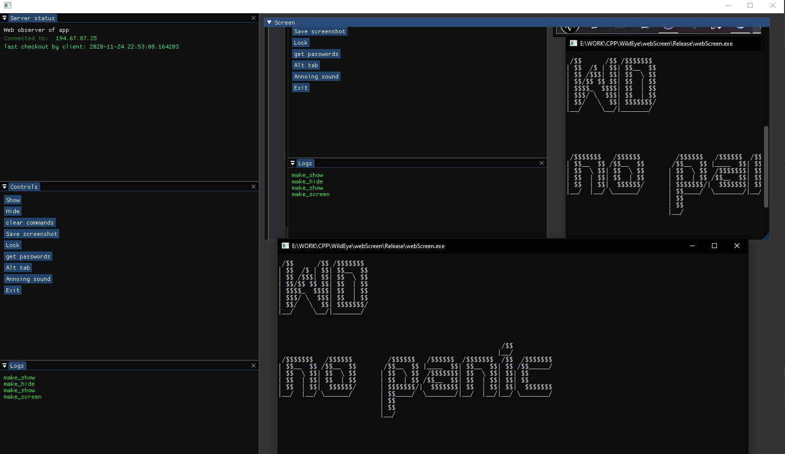
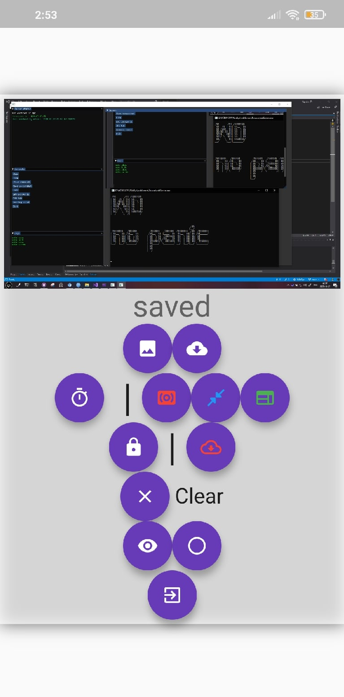

# Wild Eye
In short it is an appliction for controlling your pc from another pc/smartphone. This repository has desctop programm itself, mobile and desctop applications for controlling it and server programm.

### Warning
> Code is quite dirty

# about folders
 - [web screen](webScreen): programm that should be run on controlled computer. It's written in c++
 - [hackyserver](hackyserver): server app that allows devises to communicate
 - [webObserver](webObserver): C++ programm for controlling another machine
 - [flutterControl](flutterControl): mobile app that does the same stuff

